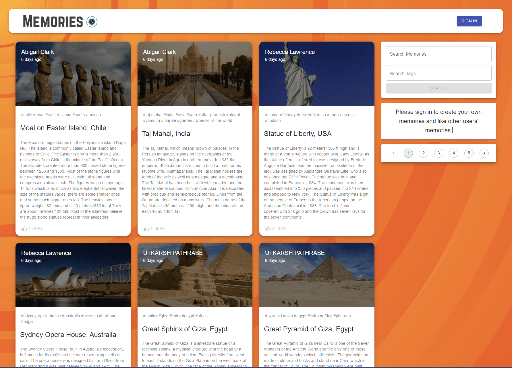
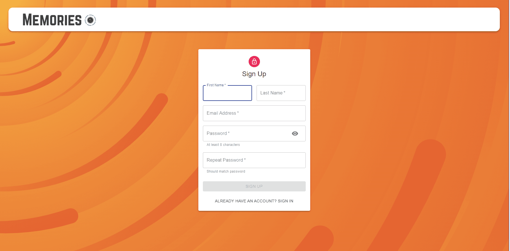
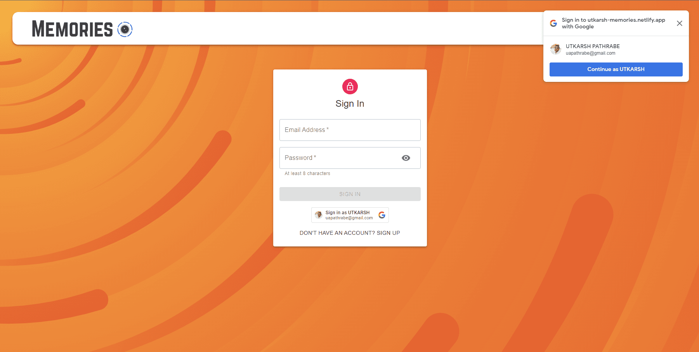
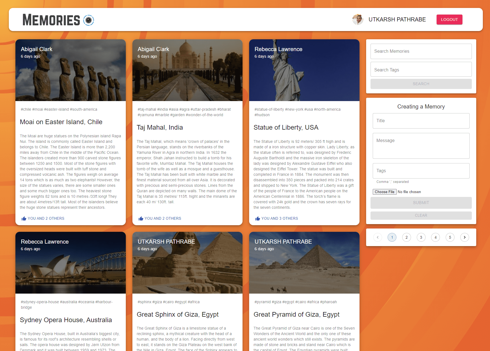
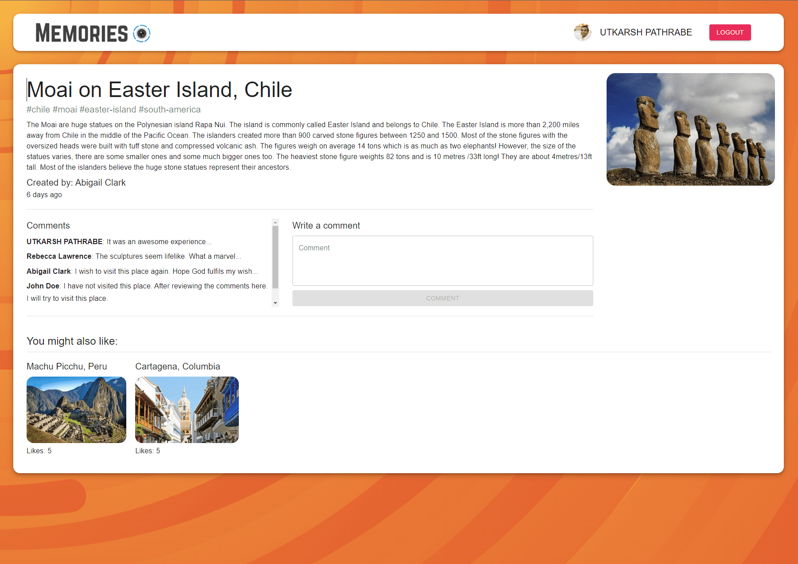

Memories
========

[Live website](https://utkarsh-memories.netlify.app/)

"Memories" is a dynamic full-stack application developed using the MERN (MongoDB, Express, ReactJS, NodeJS) technology stack. This app provides users with a platform to share and relive significant moments from their lives. By combining ReactJS for the frontend, NodeJS with Express for the backend, and MongoDB for the database, "Memories" offers a seamless and interactive experience.

The core concept of the "Memories" application is to serve as a straightforward yet engaging social media platform. Users can create posts to share interesting and meaningful events that have occurred in their lives. Whether it's an exciting adventure, a heartwarming story, or any other memorable moment, users can compose and publish posts to capture these experiences.

The application facilitates user interaction by allowing them to post, like, and comment on each other's memories. With a user-friendly interface and responsive design, the "Memories" app ensures an enjoyable experience across various devices and screen sizes.

Through its integration of ReactJS, the frontend offers a dynamic and visually appealing interface that encourages user engagement. Meanwhile, the backend, powered by NodeJS and Express, handles data processing, user authentication, and communication with the MongoDB database.

In summary, "Memories" is a MERN full-stack application that enables users to create, share, and engage with personal memories and stories. By combining these technologies, it provides a comprehensive platform for connecting with others through the joyous moments that shape our lives.  

  

  

  

  

  
